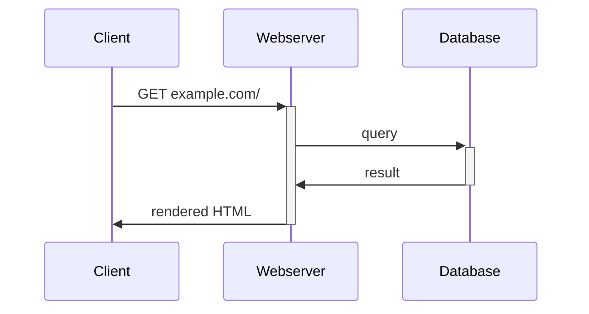
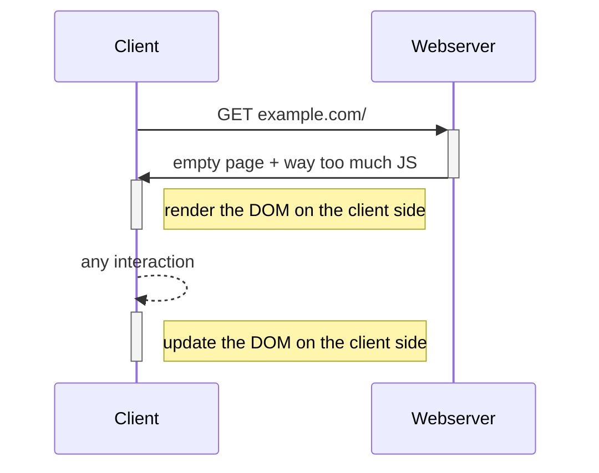
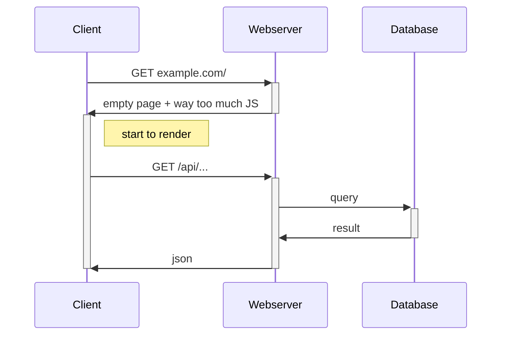
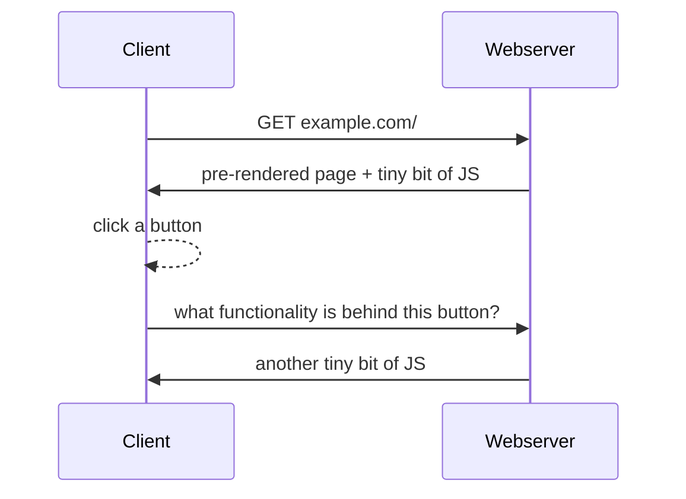

# Server side rendering (SSR)

vs

# Client side rendering (CSR)

---

## How websites worked in the "past"

// render ≠ paint 

👎 every following interaction causes another roundtrip to the server

---

## How websites work "today"

<v-clicks>

👍 Reacts immediately to interactions

👎 Long **initial load time** due to loading and parsing a big JS bundle

</v-clicks>

---

## How websites *actually* work "today"

<!-- only actual data is sent, not the whole page again -->

---

## How websites *could* work today

ℹ️ this is not how react works, but rather the approach of [qwik](https://qwik.dev/) or [htmx](https://htmx.org/)

👍 Content is also accessible by bots

