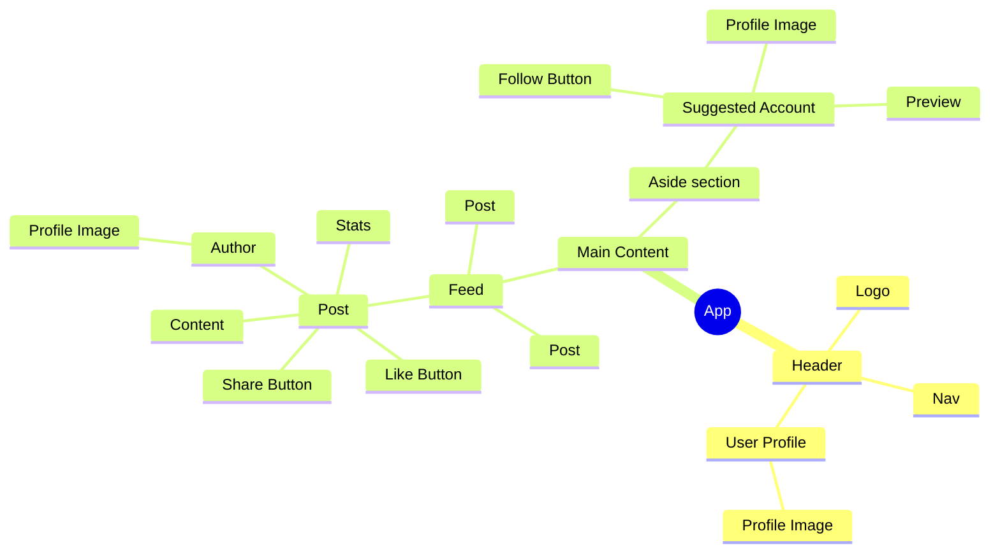

# Composition of components

React applications are a tree of components
<div mt-10>

</div>

<small abs-bl ml-55 mb-5>see also examples at [react.dev/learn](https://react.dev/learn)</small>

---

# A single component

```jsx
export const LikeButton = ({ likes }) => {
  return (
    <button type="button" className="nice-styles">{likes} 👍</button>
  );
};

```

<button type="button" rounded color-white bg-violet p-1 active-scale-90>12 👍</button>

---

# A component used within another component

```jsx
export const LikeButton = ({ likes }) => {
  return (
    <button type="button" className="nice-styles">{likes} 👍</button>
  );
};
```

```jsx
export const Post = ({ postId, content, likes }) => {
  return (
    <CardLayout>
      <p>{content}</p>
      <LikeButton likes={likes} />
    </CardLayout>
  );
}
```

<div shadow-md border p-3 w-80 rounded>
<p mt-0>My hot take on JS 🔥</p>
<button type="button" rounded color-white bg-violet p-1 active-scale-90>12 👍</button>
</div>

---

# Passing children to components

```jsx
export const CardLayout = ({ children }) => {
  return (
    <div className="card-style">
      {children}
    </div>
  );
};
```

---

# A component communicating with its parent

```jsx
export const LikeButton = ({ likes, likeHandler }) => {
  return (
    <button type="button" className="nice-styles" onClick={() => likeHandler()}>{likes} 👍</button>
  );
};
```

```jsx
export const Post = ({ postId, content, likes }) => {
  const handleLike = () => {
    /* talk to the backend*/
  };
  return (
    <CardLayout>
      <p>{content}</p>
      <LikeButton likes={likes} likeHandler={handleLike} />
    </CardLayout>
  );
};
```

<div shadow-md border p-3 w-80 rounded>
<p>My hot take on JS 🔥</p>
<button type="button" rounded color-white bg-violet p-1 active-scale-90>12 👍</button>
</div>

---
layout: two-cols
---

# Rendering a list of components

```jsx
export const Feed = ({ postings }) => {
  return (
    <main>
      {postings.map(post =>
        <Post
          key={post.id}
          postId={post.id}
          content={post.content}
          likes={post.likes}
        />
      )}
    </main>
  );
};
```

A key is needed to help React identify which list item needs an update

::right::

<div pl-5 flex flex-col gap-4>
<div shadow-md border p-3 w-80 rounded>
<p>My hot take on JS 🔥</p>
<button type="button" rounded color-white bg-violet p-1 active-scale-90>12 👍</button>
</div>
<div shadow-md border p-3 w-80 rounded>
<p>A sponsored post</p>
<button type="button" rounded color-white bg-violet p-1 active-scale-90>0 👍</button>
</div>
<div shadow-md border p-3 w-80 rounded>
<p>Why you should visit <a href="https://react.dev/learn">react.dev/learn</a></p>
<button type="button" rounded color-white bg-violet p-1 active-scale-90>42 👍</button>
</div>
</div>
