# useState 💾

Make your components remember values across render cycles

````md magic-move

```jsx
import { useState } from "react"

const [state, setState] = useState(/*initial state*/)
```

```jsx
import { useState } from "react"

export const NewPost = () => {

    const [state, setState] = useState(/*initial state*/)
    
    return (
        // ...
    )
}
```

```jsx
import { useState } from "react"

export const NewPost = () => {
    
    const [state, setState] = useState(/*initial state*/)
    
    return (
      <CardLayout>
        <input type="text"
          value={/*...*/}
          onChange={/*...*/}/>
      </CardLayout>
    )
}
```

```jsx
import { useState } from "react"

export const NewPost = () => {
    
    const [content, setContent] = useState("")
    
    return (
      <CardLayout>
        <input type="text"
          value={/*...*/}
          onChange={/*...*/}/>
      </CardLayout>
    )
}
```

```jsx
import { useState } from "react"

export const NewPost = () => {
    
    const [content, setContent] = useState("")
    
    return (
      <CardLayout>
        <input type="text"
          value={content}
          onChange={(event) => setContent(event.target.value)}/>
      </CardLayout>
    )
}
```

```jsx
import { useState } from "react"

export const NewPost = () => {
    
    const [content, setContent] = useState("")
    
    const tooLong = content.length > 50
    
    return (
      <CardLayout>
        <input type="text"
          value={content}
          onChange={(event) => setContent(event.target.value)}/>
      </CardLayout>
    )
}
```

```jsx
import { useState } from "react"

export const NewPost = () => {
    
    const [content, setContent] = useState("")
    
    const tooLong = content.length > 50
    
    return (
      <CardLayout>
        <input type="text"
          value={content}
          onChange={(event) => setContent(event.target.value)}/>
        {tooLong && (<span>Too many characters</span>)}
      </CardLayout>
    )
}
```

```jsx
import { useState } from "react"

export const NewPost = () => {
    
    const [content, setContent] = useState("")
    
    const tooLong = content.length > 50
    
    const sendPost = () => {
        // network call using current value of content
    }
    
    return (
      <CardLayout>
        <input type="text"
          value={content}
          onChange={(event) => setContent(event.target.value)}/>
        {tooLong && (<span>Too many characters</span>)}
        <button disabled={tooLong} onClick={() => sendPost()}>Send</button>
      </CardLayout>
    )
}
```
````

<small abs-br m-6>see also [useState 🪝](https://react.dev/reference/react/useState)</small>

---

# Common pitfall 🕳️

If state updates depend on previous values

````md magic-move
```jsx
import { useState } from "react";

export const LikeCounter = () => {
  const [count, setCount] = useState(0);

  const countUp = () => {
    setCount(count + 1);
  };

  return (
    <>
      <span>{count}</span>
      <button onClick={() => countUp()}>+1</button>
    </>
  );
};
```

```jsx
import { useState } from "react";

export const LikeCounter = () => {
  const [count, setCount] = useState(0);

  const countUp = () => {
    setCount((previousCount) => previousCount + 1));
  };

  return (
    <>
      <span>{count}</span>
      <button onClick={() => countUp()}>+1</button>
    </>
  );
};
```
````

<p v-click.hide="1">Issues can arise if multiple state updates are batched or happen asynchronously</p>
<p v-click="1">Using the functional form of <em>set</em> solves the issue</p>

---

# Where to keep the state?

`useState` is perfect for local state

e.g.: Number of likes

```mermaid
    flowchart TD
    Feed(Feed)
    Feed --> Post1(Post)
    Feed --> Post2(Post)
    Feed --> Post3(Post)
    Post1 --> LikeCounter1(LikeCounter<br/>💾)
Post2 --> LikeCounter2(LikeCounter<br/>💾)
Post3 --> LikeCounter3(LikeCounter<br/>💾)
```



---

# Where to keep the state?

Shared state needs to be passed down

e.g.: Time of previous update to highlight new posts

```mermaid
    flowchart TD
    Feed(Feed 💾)
Feed -- 💾 --> Post1(Post)
Feed -- 💾 --> Post2(Post)
Feed -- 💾 --> Post3(Post)
Post1 --> LikeCounter1(LikeCounter)
Post2 --> LikeCounter2(LikeCounter)
Post3 --> LikeCounter3(LikeCounter)
```



---

# Where to keep the state?

Global state might be kept in a context to prevent "prop-drilling"

e.g.: Chosen theme influences how posts are represented

```mermaid
    flowchart TD
    App(App<br/>provides a context 💾 )
App -- more layers in between --> Feed(Feed)
Feed --> Post1(Post<br/>💾)
Feed --> Post2(Post<br/>💾)
Feed --> Post3(Post<br/>💾)
```



<small abs-br m-6>see also [useContext 🪝](https://react.dev/reference/react/useContext)</small>

---

# Keep the state outside of React

Many libraries exist for handling state outside of react

* [Redux](https://redux.js.org/)
* [Mobx](https://mobx.js.org/README.html)
* [Recoil](https://recoiljs.org/)
* [Zustand](https://zustand-demo.pmnd.rs/)
* [Jotai](https://jotai.org/)
* ...