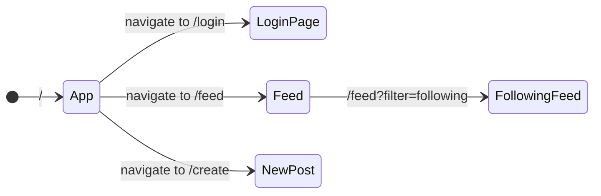

# Routing 🔀

Rendering different components based on the current path or query



---
layout: iframe-right
url: https://reactrouter.com/
---

# React Router

[reactrouter.com](https://reactrouter.com/)

Add to your project with

`npm i react-router`

---

# Routing example

````md magic-move
```jsx
import { BrowserRouter } from "react-router";

<BrowserRouter>
  
</BrowserRouter>
```

```jsx
...
import { BrowserRouter, Routes, Route } from "react-router";

<BrowserRouter>
  <Routes>
    <Route index element={<Home />} />
    <Route path="about" element={<About />} />
  </Routes>
</BrowserRouter>
```

```jsx
...
import { BrowserRouter, Routes, Route } from "react-router";

<BrowserRouter>
  <Routes>
    <Route index element={<Home />} />
    <Route path="about" element={<About />} />
    
    <!-- layout route -->
    <Route element={<AuthLayout />}>
      <Route path="login" element={<Login />} />
      <Route path="register" element={<Register />} />
    </Route>
  </Routes>
</BrowserRouter>
```

```jsx
...
import { BrowserRouter, Routes, Route } from "react-router";

<BrowserRouter>
  <Routes>
    <Route index element={<Home />} />
    <Route path="about" element={<About />} />
    
    <!-- layout route -->
    <Route element={<AuthLayout />}>
      <Route path="login" element={<Login />} />
      <Route path="register" element={<Register />} />
    </Route>
    
    <!-- nested routes -->
    <Route path="concerts">
      <Route index element={<ConcertsHome />} />
      <Route path=":city" element={<City />} />
      <Route path="trending" element={<Trending />} />
    </Route>
  </Routes>
</BrowserRouter>
```
````

<small abs-br m-6>see also [reactrouter.com/start/library/routing](https://reactrouter.com/start/library/routing)</small>

---

# Switching routes within the app

Replace `anchor` tags with `Link`

````md magic-move
```jsx
<nav>
  <a href="/">Home</a>
  <a href="/about">About</a>
  <a href="/login">Login</a>
  <a href="/register">Register</a>
  <a href="/concerts">Concerts</a>
</nav>
```

```jsx
<nav>
  <Link to="/">Home</Link>
  <Link to="/about">About</Link>
  <Link to="/login">Login</Link>
  <Link to="/register">Register</Link>
  <Link to="/concerts">Concerts</Link>
</nav>
```
````

---

# Accessing path and query variables

Given we are within the route /posts/:postId

```jsx
import { useParams } from "react-router";

export const PostDetails = () => {
  const params = useParams();

  const postId = params.postId; // <- contains the path parameter

...
};

```

For query params a similar hook can be used:

```jsx
...
const [searchParams, setSearchParams] = useSearchParams();
...
```