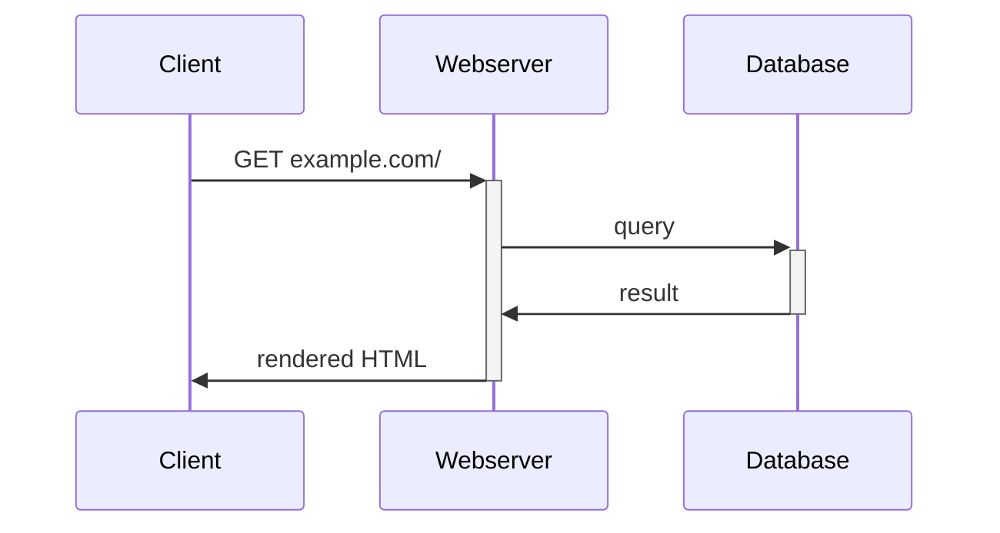
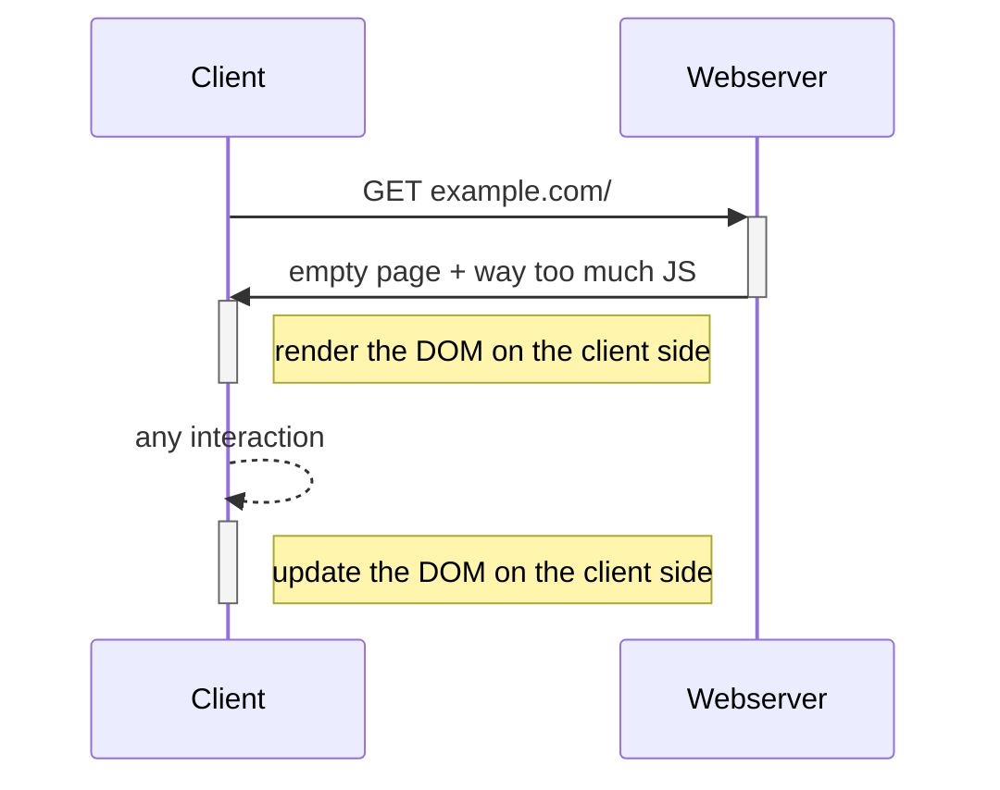
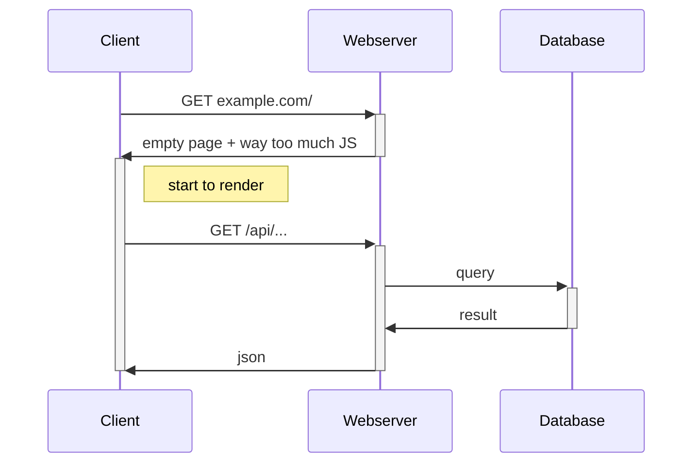
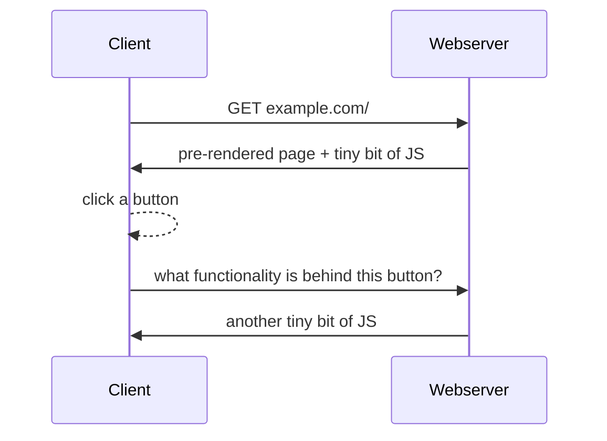

# React <logos-react animate-spin animate-duration-5000/>

---
layout: iframe-right
url: https://andreas.taranetz.com
---

# > whoami

[andreas.taranetz.com](https://andreas.taranetz.com)


<p text-center>👆 Link to this slide deck</p>

---
layout: section
---

# Server side rendering (SSR)

<span text-3xl>vs</span>

# Single Page Applications (SPA)

---

## How websites worked in the "past"

<div my-10 text-center>

<span text-gray text-sm>// render ≠ paint </span>

</div>

<p text-center v-click>👎 every following interaction causes another roundtrip to the server</p>

---

## How websites work "today"

<div text-center>


<v-clicks>

👍 Reacts immediately to interactions

👎 Long **initial load time** due to loading and parsing a big JS bundle

</v-clicks>

</div>

---

## How websites *actually* work "today"

<div text-center>

</div>

<!-- only actual data is sent, not the whole page again -->

---

## How websites *could* work today

<div text-center>


ℹ️ this is not how react works, but rather the approach of [qwik](https://qwik.dev/) or [htmx](https://htmx.org/)

<span v-click>👍 Content is also accessible by bots</span>
</div>


---
layout: section
---

# Why useReact?

---

# Some props

<v-clicks text-xl>

- 📚 Javascript library for building user interfaces (not only web)
- ✨ Does **not require** a compiler or build step
- 🛠️ Developed by Meta <logos-meta bg-white rounded p-0.2/>
- 🗓️ Released 2013-05-29
- ✅ Current stable version **18.3**
- Used by other meta-frameworks: <span text-gray text-sm>// not developed by <logos-meta bg-white rounded p-0.2/></span>
    - Next <logos-nextjs bg-white rounded p-0.2/>
    - Remix <logos-remix bg-white rounded p-0.2/>
    - Gatsby <logos-gatsby />

</v-clicks>

---

<h1>
<span v-mark="{color: 'red', type: 'strike-through', strokeWidth: 10}">Interest</span>
<span ml-5 v-after="1" fade-in>Searches necessary to get it to work</span>
</h1>

[Google trends](https://trends.google.com/trends/explore?q=react,angular)


---
layout: image-right
image: /developer-survey.png
backgroundSize: contain
---

# Popularity

[Stackoverflow developer survey 2024](https://survey.stackoverflow.co/2024/technology#1-web-frameworks-and-technologies)

> Which web frameworks and web technologies have you done extensive development work in over the past year, and which do you want to work in over the next year?

---
layout: two-cols
---

# Nice

<v-clicks text-xl>

- $view = f(state)$
- Composable components
- Can be used for any kind of UI
- Big ecosystem
- Not opinionated

</v-clicks>

::right::

# Meh

<v-clicks text-xl>

- No builtin way to handle data fetching
- No builtin routing
- No builtin internationalization features
- No builtin forms
- Not opinionated

</v-clicks>

---
layout: section
---

# What is our main issue when building web based UIs?

---
layout: center
zoom: 1.3
---
Can we have DOM manipulation?

No, we have DOM manipulation at home

DOM manipulation at home: <logos-jquery m-1 bg-white rounded/>

---

# Manipulate the DOM without any libaries

```js {monaco-run} {autorun:false}
const root = document.getElementById('root')

console.log(root.textContent)
//console.log(root.outerHTML)
```

<div id="root" class="my-10 border">
    🚧 Root div under construction 🚧
</div>

<div v-click>

```js {monaco-run} {autorun:false}
const root = document.getElementById('root')

const span = document.createElement('span')
span.textContent = ['🙈', '🙊', '🙉'].at(Math.random() * 3)
span.className = 'bg-red'

root.append(span)
```

</div>
---

# Let's do this using React

````md magic-move {lines: true}
```js  
const root = document.getElementById('root')

const span = document.createElement('span')
span.textContent = 'Hello World'
span.className = 'bg-red'

root.append(span)
```

```js  {1,2|6-8}
import React from "react"
import ReactDOM from "react-dom"

const root = document.getElementById('root')

const span = document.createElement('span')
span.textContent = 'Hello World'
span.className = 'bg-red'

root.append(span)
```

```js {6|4}
import React from "react"
import ReactDOM from "react-dom"

const root = document.getElementById('root')

const SpanComponent = React.createElement('span', {className: 'bg-red'}, 'Hello World')

root.append(span)
```

```js {4|8}
import React from "react"
import ReactDOM from "react-dom"

const appRoot = ReactDOM.createRoot(document.getElementById('root'))

const SpanComponent = React.createElement('span', {className: 'bg-red'}, 'Hello World')

root.append(span)
```

```js {8|*}
import React from "react"
import ReactDOM from "react-dom"

const appRoot = ReactDOM.createRoot(document.getElementById('root'))

const SpanComponent = React.createElement('span', {className: 'bg-red'}, 'Hello World')

appRoot.render(SpanComponent)
```
````

---

<style>
.bg-red {
 background: red;
}
</style>

# Demo time

```js {monaco-run} {autorun:false} 
import React from "react"
import ReactDOM from "react-dom"

const appRoot = ReactDOM.createRoot(document.getElementById('root2'))

const SpanComponent = React.createElement('span', { className: 'bg-red' }, 'Hello World')

appRoot.render(SpanComponent)
```

<div id="root2" class="my-10 border">
    🚧 Root div under construction 🚧
</div>

---

<style>
.bg-red{
 background: red;
}

.spaced-out {
    display: flex;
    justify-content: space-around;
}
</style>

# Demo time with composition

```js {monaco-run} {autorun:false} 
import React from "react"
import ReactDOM from "react-dom"

const appRoot = ReactDOM.createRoot(document.getElementById('root3'))

const SpanComponent = React.createElement("span", { className: 'bg-red' }, 'Hello World')
const TextBlock = React.createElement("p", { className: 'spaced-out' }, [SpanComponent, SpanComponent, SpanComponent])

appRoot.render(TextBlock)
```

<div id="root3" class="my-10 border">
    🚧 Root div under construction 🚧
</div>

---

# What is `React.createElement()` doing?

Inputs:

`type` React component type: tag name (`div`, `span`, ...) | React component name

`props` Object | null

`children` optional list of child nodes

<v-click>

```js {monaco-run} 
import { createElement } from "react"

console.log(createElement("span", { className: 'bg-red' }, 'Hello World'))
```

</v-click>

---
layout: two-cols
---

# How pixels are made

1. Virtual dome is recalculated

    - during initial render
    - when state updates occur

2. Render Phase (done by React):

    - create / update the element tree
    - check for differences to the current tree

3. Commit Phase (done by ReactDOM):

    - create / update / delete DOM elements
    - only those that actually need to change

4. Painting the document (done by the browser)

<small>see also: [react.dev/learn/render-and-commit](https://react.dev/learn/render-and-commit)</small>

::right::

<div ml-10 flex flex-col gap-3>


</div>

---
layout: iframe-right
url: https://18.react.dev/
---

# How to get started

https://18.react.dev/

Start a new project using react with typescript:

```bash
npm create vite@latest -- --template=react-ts
```

choose a name, e.g.: `playground`

```bash
cd playground # switch into the new folder
npm install   # install all dependencies
npm run dev   # run the development server
```

The output should look something like this:

```bash
 VITE v6.0.3  ready in 594 ms

  ➜  Local:   http://localhost:5173/
  ➜  Network: use --host to expose
  ➜  press h + enter to show help
```

---
layout: end
---
